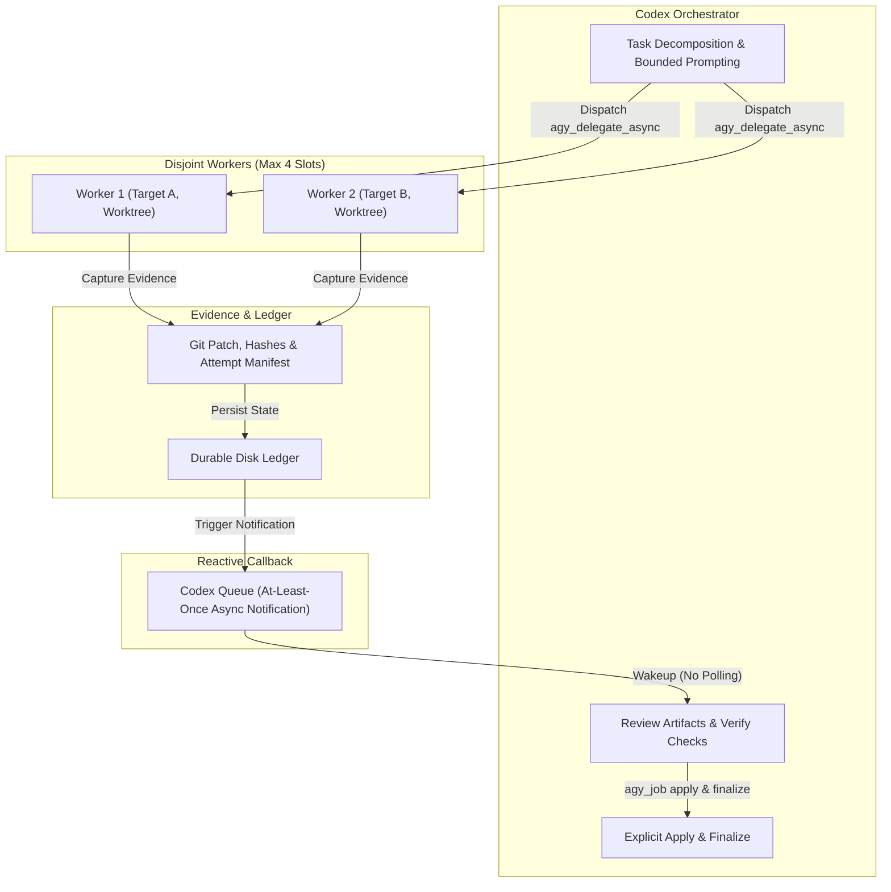
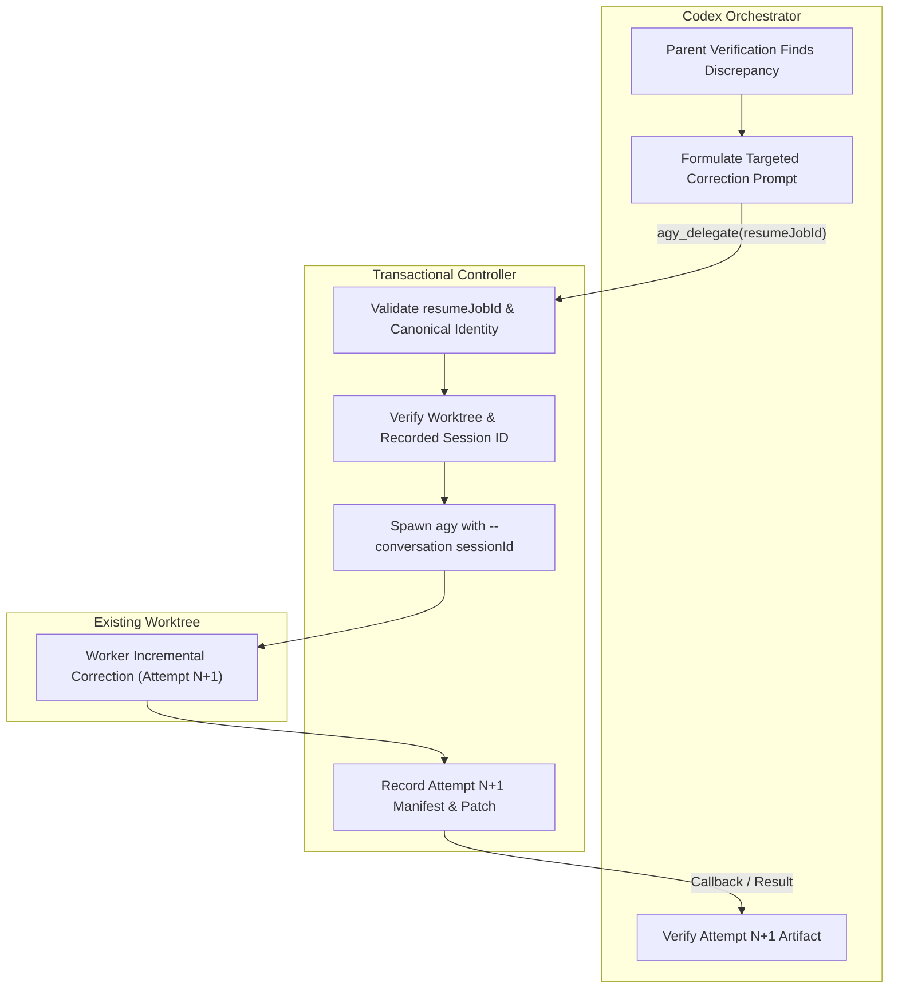

# Transactional Antigravity Harness for Codex

[](https://github.com/dedsec-terminal/transactional-antigravity-harness/actions/workflows/ci.yml)
[](LICENSE)

An orchestration harness and Model Context Protocol (MCP) server that enables primary AI coding agents (such as OpenAI Codex) to safely delegate bounded tasks to the local Google Antigravity CLI (`agy`) as an isolated second worker.

This project provides a transactional execution layer, git worktree isolation, process lease management, and structured callback reporting so tasks can be parallelized and verified deterministically.

> **Disclaimer**: This is an independent open-source developer tool. It is not affiliated with, endorsed by, or sponsored by Google or OpenAI.

---

## Architecture Overview

The primary agent directs task decomposition, assigns disjoint workspace scopes, and retains sole authority over verifying and merging changes. Delegated work runs in ephemeral worktrees with strict process oversight.



---

## Key Capabilities

* **Dual Execution Modes**:
  * **Synchronous (`agy_delegate`)**: Quick turnaround for bounded single-file edits, reviews, or plans.
  * **Asynchronous (`agy_delegate_async`)**: Background task dispatch with reactive completion notification via `codex queue` to avoid busy-polling.
* **Transactional Worktree Isolation**: Mutating tasks (`accept-edits`) run in isolated ephemeral git worktrees by default (`isolation: "worktree"`), with optional Git cone sparse checkout (`sparseCheckout: true`, CLI `--sparse-checkout`). Canonical repository files remain clean until changes are validated.
* **Bounded Parallel Fan-out**: Up to 4 parallel workers (`MAX_WORKER_SLOTS = 4`) targeting non-overlapping file paths or directory prefixes.
* **Windows & POSIX Process Stability**: Stdin NDJSON prompt delivery avoids Windows command-line character limits. Process tree teardowns use `taskkill /PID /T /F` on Windows and `SIGTERM` process groups on POSIX.
* **Complete Job Lifecycle Management (`agy_job`)**: Inspect job status, list attempts, cancel active workers, reconcile stale leases, and explicitly apply or finalize changes.
* **Lean, Typed Output Contract**: Workers report status through a strict JSON schema (`status`, `summary`, `verification`, `claimedChangedPaths`). Callbacks return a compact three-line report instead of noisy raw diffs.

---

## Performance & Token Architecture

For comprehensive architecture details, isolation models, and engineering guardrails, see [docs/performance.md](docs/performance.md).

### Token-Efficient Task Routing

* **Bounded Prompts**: Atomic tasks constrained by the Four-Pillar prompt format (`TARGETS`, `ACTION`, `CONSTRAINTS`, `VERIFICATION`) eliminate conversational and repo bloat.
* **Disjoint Concurrency (Max 4 Workers)**: Up to 4 parallel workers (`MAX_WORKER_SLOTS = 4`) target non-overlapping file paths or directory prefixes to prevent collision and rework tokens.
* **Async Callbacks (No Polling)**: `codex queue` reactive notification wakes the orchestrator; no busy-polling loops (`agy_job status`) consuming tokens and API turns.
* **Shared Read-Only Plan vs Worktree Mutation**: Only synchronous planning (`agy_delegate` with `mode: "plan"`) defaults to `isolation: "shared"`, which relies on trusted read-only instructions rather than an OS-level sandbox. Asynchronous planning and mutating edits (`mode: "accept-edits"`) strictly isolate in git worktrees.
* **Exact-Session Correction Loop (`resumeJobId`)**: Passing `resumeJobId` reconnects directly to the existing worktree and reuses the recorded conversation session (`--conversation <sessionId>`), requiring a saved session ID; it does not guarantee cached-token savings or eliminate repository reindexing.



### Architectural Lineage & Realities

* **Disk & Context Isolation**: Combines disk-isolated checkouts ([Cursor Worktrees](https://cursor.com/docs/configuration/worktrees)) and separate focused context windows ([Claude Code Sub-agents](https://code.claude.com/docs/en/sub-agents)) with hash-verified artifact validation.
* **Grounded Performance**: Worktree creation involves standard OS filesystem operations rather than "zero I/O". There are no guaranteed speedups, token savings, or delivery guarantees; operational benefits depend on task decomposition and parallel execution.
* **Engineering Guardrails**: Opt-in sparse checkout (`sparseCheckout: true`, CLI `--sparse-checkout`) is implemented using Git cone mode; full checkout remains the default. Selecting a tracked file expands to parent directory siblings; root files are present, and unrelated subtrees are absent. Targets must exist at base commit, so callers creating new files must target an existing parent directory. Sparse checkout is recommended only for bounded self-contained edits; full checkout remains recommended for repo-wide or cross-module checks. Measured speedup is not yet claimed. Durable disk ledgers are retained for crash safety and reconciliation without RAM-only defaults or failover authority expansion; and the MCP embedded controller is deferred until empirical measurements justify lifecycle changes.

---

## Safety & Lifecycle Model

1. **Trusted Headless Execution Boundary**: The runner executes `agy` with `--dangerously-skip-permissions` to allow unattended execution in non-interactive environments. Never delegate credentials, secrets, destructive shell commands, or deployments without separate user approval.
2. **Untrusted Worker Principle**: Worker claims are untrusted by default. The parent orchestrator inspects actual git/filesystem diffs and executes automated tests before changes are accepted.
3. **Explicit Apply & Finalize**: Completed worktree changes are never merged automatically. The parent orchestrator reviews the patch hash, applies verified changes, and cleans up the worktree.
4. **Path Traversal Protection**: Target paths are constrained to the workspace root; directory traversal (`..`) attempts outside the workspace are rejected.
5. **Retention Policies**:

   * **Worktrees**: Retained for 24 hours (1,440 minutes by default) to allow manual inspection and debugging before disposal.
   * **Evidence Ledger**: Job logs, terminal events, and hashes are kept for 14 days for forensic traceability.

---

## Prerequisites

* **Node.js**: Version `>= 20.0.0`
* **npm**: Version `>= 9.0.0`
* **Git**: Installed and available on `PATH`
* **Google Antigravity CLI**: `agy` installed and authenticated on your local machine (`agy.exe` on `PATH` or in `%LOCALAPPDATA%\agy\bin\` on Windows).
* **OpenAI Codex CLI** *(optional, required for async notifications)*: Installed and available on `PATH` to deliver asynchronous callbacks via `codex queue`.

---

## Distribution & Installation

### 1. Codex Plugin Marketplace (Repo Marketplace)

Add this repository as a repository marketplace and install the `antigravity-subagent` plugin:

```bash
# Register the repository marketplace
codex plugin marketplace add dedsec-terminal/transactional-antigravity-harness

# Install the subagent plugin from the registered marketplace
codex plugin add antigravity-subagent@dedsec-terminal-plugins
```

> **Marketplace Distinction**: This command registers a direct **repository marketplace** (`dedsec-terminal/transactional-antigravity-harness`), which is distinct from the **OpenAI universal public directory**. Plugins are sourced directly from this repository rather than a centralized public catalog.

---

### 2. GitHub Packages (`@dedsec-terminal/agy-mcp-server`)

The pre-built MCP server is published to **GitHub Packages** as `@dedsec-terminal/agy-mcp-server`.

> **Registry Distinction**: **GitHub Packages** (`npm.pkg.github.com`) is a package registry for hosting software packages, distinct from **GitHub Marketplace** (which distributes GitHub Actions and GitHub Apps).

#### Authentication & PAT Security

Installing from `npm.pkg.github.com` requires authentication with a GitHub **classic Personal Access Token (PAT)** with the `read:packages` scope:

* **Configure safely**: Store the token in your user-level configuration (`~/.npmrc`) or provide it via the `NODE_AUTH_TOKEN` environment variable.
* **Never commit secrets**: Never commit your PAT, tokens, or credential-bearing `.npmrc` files to version control or repository trees.

Example user-level configuration (`~/.npmrc`):
```ini
@dedsec-terminal:registry=https://npm.pkg.github.com
//npm.pkg.github.com/:_authToken=YOUR_CLASSIC_PAT
```

Configure the package in your Codex or MCP host configuration (`.mcp.json`):
```json
{
  "mcpServers": {
    "agy": {
      "command": "npx",
      "args": ["-y", "@dedsec-terminal/agy-mcp-server"],
      "cwd": "."
    }
  }
}
```

---

### 3. Local Source Build

1. **Clone the repository**:
   ```bash
   git clone https://github.com/dedsec-terminal/transactional-antigravity-harness.git
   cd transactional-antigravity-harness/mcp
   ```

2. **Install dependencies and build the server**:
   ```bash
   npm ci
   npm run build
   ```

3. **Configure the MCP Server**:
   Add the server to your Codex or MCP host configuration (e.g. `.mcp.json`):
   ```json
   {
     "mcpServers": {
       "agy": {
         "command": "node",
         "args": ["./mcp/dist/server.cjs"],
         "cwd": "."
       }
     }
   }
   ```

---

## MCP Tool Reference

### `agy_check`
Preflight check to verify that the runner, `agy` executable, and Codex callback facilities are operational.

**Parameters**: None

```json
{}
```

### `agy_delegate`
Synchronously delegates a bounded task to Antigravity and waits for the result.

**Parameters**:

* `prompt` (string, required): Bounded task description.
* `cwd` (string, required): Absolute path to the workspace root.
* `mode` (`"plan"` | `"accept-edits"`, default `"accept-edits"`): Task execution mode.
* `targets` (string[], optional): Array of workspace-relative paths or directory prefixes assigned to this worker.
* `isolation` (`"worktree"` | `"shared"`, optional): Defaults to `"worktree"` for mutating edits; `"shared"` is only permitted for `"plan"`.
* `sparseCheckout` (boolean, optional, default `false`): Explicit opt-in for Git cone sparse worktree checkout. Restricts checkout to directories of specified `targets` plus root files while omitting unrelated subtrees. Cone behavior: selected tracked file expands to parent directory siblings; root files present; unrelated subtrees absent. Targets must exist at base commit (use existing parent directory target when creating new files). Recommended only for bounded self-contained edits; full checkout is recommended for cross-module checks. Measured speedup is not yet claimed.
* `timeoutSeconds` (number, default `300`): Execution timeout (1–1800s). Sizing target is under 25s.
* `outputFormat` (`"text"` | `"json"`, default `"text"`): Desired output structure.
* `resumeJobId` (string, optional): Resume a prior job attempt in its existing worktree.

```json
{
  "cwd": "/path/to/workspace",
  "mode": "accept-edits",
  "targets": ["src/parser/"],
  "sparseCheckout": true,
  "prompt": "Add unit tests for escape sequence edge cases in token parsing.",
  "timeoutSeconds": 300,
  "outputFormat": "text"
}
```

### `agy_delegate_async`
Dispatches a background worker task and returns an immediate acknowledgement. When complete, notifies the designated Codex thread.

**Parameters**: All parameters from `agy_delegate`, plus:

* `notifyThread` (string, required): Single-line Codex thread identifier (max 200 characters) to wake upon completion.

```json
{
  "cwd": "/path/to/workspace",
  "notifyThread": "thread_abc123",
  "mode": "accept-edits",
  "targets": ["src/parser/"],
  "prompt": "Benchmark parser performance under high concurrency.",
  "timeoutSeconds": 300,
  "outputFormat": "text"
}
```

### `agy_job`
Inspects or manages the lifecycle of transactional jobs.

**Parameters**:

* `action` (`"status"` | `"list"` | `"cancel"` | `"reconcile"` | `"apply"` | `"finalize"`, required): The job action to execute.
* `jobId` (string, required for all actions except `"list"` and `"reconcile"`): The UUID of the job.
* `args` (object, optional): Additional parameters for specific actions (such as artifact hash validation for `"apply"`).

```json
{
  "action": "status",
  "jobId": "b18b4562-43f1-4db3-9ec7-c0e66a2e4dc4"
}
```

---

## Direct CLI Runner

The bundled runner can be invoked directly from the command line:

```text
Usage: agy-delegate.mjs --check | --job-action ACTION [--job-args-json JSON] | --cwd PATH --prompt-file PATH [--targets-json JSON] [--mode plan|accept-edits] [--isolation shared|worktree] [--sparse-checkout] [--resume-job-id ID] [--notify-thread ID --async]
```

### Examples

* **System health preflight**:
  ```bash
  node skills/delegate-to-antigravity/scripts/agy-delegate.mjs --check
  ```
* **Synchronous run**:
  ```bash
  node skills/delegate-to-antigravity/scripts/agy-delegate.mjs \
    --cwd /path/to/workspace \
    --prompt-file /path/to/prompt.md \
    --mode accept-edits \
    --targets-json '["src/index.ts"]' \
    --timeout-seconds 300
  ```
* **Synchronous run with sparse checkout**:
  ```bash
  node skills/delegate-to-antigravity/scripts/agy-delegate.mjs \
    --cwd /path/to/workspace \
    --prompt-file /path/to/prompt.md \
    --mode accept-edits \
    --targets-json '["src/index.ts"]' \
    --sparse-checkout \
    --timeout-seconds 300
  ```
* **Asynchronous run**:
  ```bash
  node skills/delegate-to-antigravity/scripts/agy-delegate.mjs \
    --cwd /path/to/workspace \
    --prompt-file /path/to/prompt.md \
    --mode accept-edits \
    --notify-thread "thread_abc123" \
    --async
  ```

---

## Development & Testing

All build and test scripts are managed inside the `mcp/` package:

```bash
cd mcp

# Build the bundled CommonJS server
npm run build

# Run TypeScript type checks
npm run check

# Run the complete test suite (contracts, leases, outbox, worktrees, smoke)
npm test

# Run protocol-only MCP server smoke tests
npm run test:protocol
```

---

## Limitations

* **Concurrency Limit**: Capped at 4 concurrent worker processes to avoid CPU and workspace exhaustion.
* **Non-Interactive Permissions**: The harness uses `--dangerously-skip-permissions` because headless background workers cannot answer interactive terminal prompts.
* **No Auto-Merge**: Git mutations are isolated in worktrees and never committed to primary working branches automatically.
* **Task Sizing**: Tasks should be scoped to finish in under 25 seconds for snappy multi-agent orchestration, though timeouts can be configured up to 300 seconds (or 1800 seconds max).

---

## Roadmap

* [ ] Configurable per-repository concurrency slot limits.
* [ ] Enhanced cross-platform process isolation and container sandboxing.
* [ ] Rich diff visualization summaries in MCP response payloads.
* [ ] Automated outbox garbage collection daemon.

---

## Governance & Community

* [Contributing Guidelines](CONTRIBUTING.md)
* [Security Policy](SECURITY.md)
* [Code of Conduct](CODE_OF_CONDUCT.md)
* [MIT License](LICENSE)
